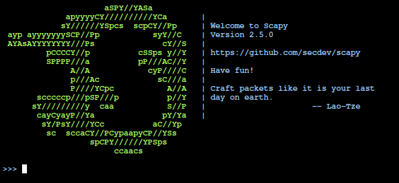

---
layout:
  title:
    visible: true
  description:
    visible: false
  tableOfContents:
    visible: true
  outline:
    visible: true
  pagination:
    visible: true
---

# Exploring Enumeration via Packet Crafting

Cuando se trata de enumeración a través de la creación y generación de paquetes, Scapy es una de las herramientas y marcos favoritos de los pentesters. Scapy es un marco o ecosistema muy completo basado en Python para la generación de paquetes. Esta sección analiza algunas de las formas sencillas en que puede utilizar esta herramienta para realizar un reconocimiento básico de la red.

```
sudo scapy
```

<figure><figcaption></figcaption></figure>

En este ejemplo, se crea un paquete ICMP simple con `malicious_payload` como la carga útil que se envía al host de destino 192.168.1.251.

```
>>> send(IP(dst="192.168.1.251")/ICMP()/"malicious_payload")
```

Scapy admite una gran cantidad de protocolos. Puede utilizar la función ls() para listar todos los formatos y protocolos disponibles.

```
>>> ls()
```

Puede utilizar la función ls() para mostrar todas las opciones y campos de un protocolo o formato de paquete específico compatible con Scapy, como se muestra en el ejemplo 3-37. Este ejemplo muestra los campos disponibles para el protocolo TCP.

```
>>> ls(TCP)
```

Paquetes DNS que pueden modificarse con Scapy

```
>>> ls(DNS)
```

Puede utilizar la función explore() para navegar por las capas y protocolos de Scapy.

Scapy puede utilizarse como un escáner de muchas formas diferentes.Puede realizar un escaneo TCP SYN simple a cualquier puerto dado.&#x20;

```
>>> ans, unans = sr(IP(dst='192.168.1.251')/TCP(dport=445,flags='S'))
```
