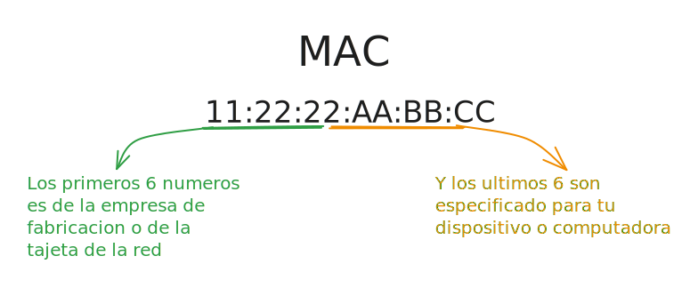

---
layout:
  title:
    visible: true
  description:
    visible: false
  tableOfContents:
    visible: true
  outline:
    visible: true
  pagination:
    visible: true
---

# Subdominios

La busquedas de subdominos,son muy importante a la hora de hacer una auditoria de pentesting o bug bounty ,generalmente las empresas muestra el alcance de los dominios.




Existen varias forma de buscar subdominos tanto de forma pasiva o activa.

**De forma activa:**

```
subfinder -d example.com >> subdominios.txt
```

```
sublist3r -d example.com  >> subdominios.txt
```

```
amass enum -d example.com -max-dns-queries 120 >> subdominios.txt
```

```
amass enum -passive -d example.com >> subdominios.txt
```

Utilice el `DNS`comando para **descubrir subdominios** con Gobuster.&#x20;

```
gobuster dns -q -r 8.8.8.8 -d example.com -w wordlists/Discovery/DNS/subdomains-top1million-5000.txt -t 4 --delay 1s -o results.txt"	 
```

```
dns modo
-q--quiet: no imprima el banner ni otros ruidos
-r--cadena de resolución: utilice un servidor DNS personalizado (formato server.com o server.com:puerto)
-d--cadena de dominio
-w--cadena de lista de palabras: ruta a la lista de palabras
-t-- subprocesos
--delay- duración del retraso
-o- cadena de salida: archivo de salida en el que escribir los resultados (el valor predeterminado es stdout)

Usando otra de las listas de palabras de Seclists /wordlists/Discovery/DNS/subdomains-top1million-5000.txt.
```


<mark style="color:red;">**Recursos**</mark>






