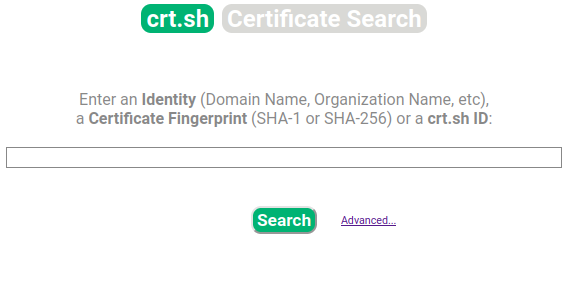

---
layout:
  title:
    visible: true
  description:
    visible: false
  tableOfContents:
    visible: true
  outline:
    visible: true
  pagination:
    visible: true
---

# Fallas criptográficas

Durante la fase de reconocimiento, los atacantes a menudo pueden inspeccionar los certificados SSL para obtener información sobre la organización, posibles fallas criptográficas e implementaciones débiles. Dentro de los certificados digitales se puede encontrar mucha información: el número de serie del certificado, el nombre común del sujeto, el URI del servidor al que se asignó, el nombre de la organización, la información del OCSP, el URI de la CRL, etc.

La revocación de certificados es el acto de invalidar un certificado digital. Por ejemplo, si una aplicación ha sido desmantelada o el certificado asignado a dicha aplicación está comprometido, se debe revocar el certificado y agregar su número de serie a una CRL. El OCSP y las CRL se utilizan para verificar si un certificado ha sido revocado (es decir, invalidado) por la autoridad emisora.

La figura 3-1 muestra el certificado digital asignado a h4cker.org. El certificado muestra la organización que emitió el certificado (en este caso, Let's Encrypt), el número de serie, el período de validez y la información de la clave pública, incluido el algoritmo, el tamaño de la clave, etc. Los atacantes pueden usar esta información para revelar cualquier configuración o implementación criptográfica débil.

**Recomendaciones para la seguridad de los certificados SSL:**

* Utilice certificados SSL emitidos por una autoridad de certificación (CA) de confianza.
* Asegúrese de que sus certificados SSL estén vigentes y que no hayan sido revocados.
* Configure sus servidores web para utilizar protocolos SSL seguros y robustos, como TLS 1.3.
* Mantenga su software actualizado, incluidos los certificados SSL.

Unas de las forma mas conocidas para verificar certificados es ir al sitio web [https://crt.sh/](https://crt.sh/)

<figure><figcaption></figcaption></figure>

| Herramienta | Descripción                                                             | Uso            |
| ----------- | ----------------------------------------------------------------------- | -------------- |
| sslscan     | Consulta los servicios SSL para determinar qué cifrados son compatibles | Reconocimiento |
| ssldump     | Analiza y decodifica el tráfico SSL                                     | Explotación    |
| sslh        | Ejecuta múltiples servicios en el puerto 443                            | Utilidad       |
| sslsplit    | Habilita los ataques MitM en conexiones de red cifradas con SSL         | Explotación    |
| sslyze      | Analiza la configuración SSL de un servidor conectándose a él           | Reconocimiento |
