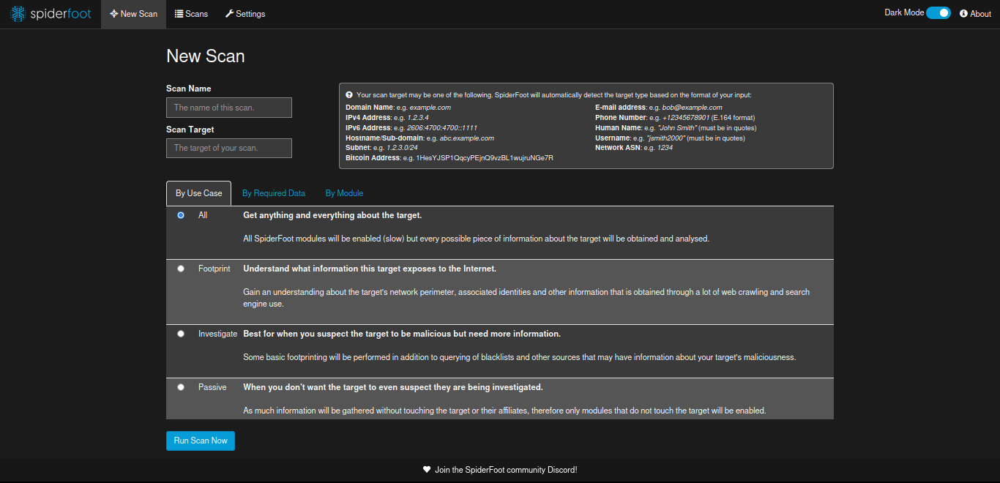

---
layout:
  title:
    visible: true
  description:
    visible: false
  tableOfContents:
    visible: true
  outline:
    visible: true
  pagination:
    visible: true
---

# SpiderFoot

SpiderFoot es un escáner OSINT automatizado que viene incluido en Kali. SpiderFoot consulta más de 1000 fuentes de información abiertas y presenta los resultados en una GUI fácil de usar. SpiderFoot también puede ejecutarse desde una consola.

SpiderFoot inicia su escaneo con uno de los siguientes elementos:

* Nombres de dominio
* Direcciones IP
* Direcciones de subred
* Números de sistema autónomo (ASN)
* Direcciones de correo electrónico
* Números de teléfono
* Nombres personales

SpiderFoot ofrece la opción de elegir escaneos en función del caso de uso, los datos requeridos y por módulo de SpiderFoot. Los casos de uso son:

* **Todo:** Obtiene toda la información posible sobre el objetivo. Este caso de uso puede tardar mucho en completarse.
* **Huella:** Comprende el perímetro de la red del objetivo, las identidades asociadas y otra información que se obtiene mediante un rastreo web exhaustivo y el uso de motores de búsqueda.
* **Investigar:** Esto es para objetivos que sospechas de comportamiento malicioso. Se devolverá la huella dactilar, las búsquedas en listas negras y otras fuentes que informan sobre sitios maliciosos.
* **Pasivo:** Este tipo de escaneo se utiliza si es indeseable que el objetivo sospeche que está siendo escaneado. Esta es una forma de OSINT pasiva.


Iniciar spiderfoot en el navegador

```
spiderfoot -l 127.0.0.1:5001
```

<figure><figcaption></figcaption></figure>
