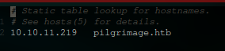

---
layout:
  title:
    visible: true
  description:
    visible: false
  tableOfContents:
    visible: true
  outline:
    visible: true
  pagination:
    visible: true
---

# Pilgrimage


<figure><figcaption></figcaption></figure>

```
10.10.11.219  pilgrimage.htb/
```

Primero configuramos el host:

<figure><figcaption></figcaption></figure>

## Reconocimiento:

```
sudo nmap -sS -p- -Pn --open 10.10.11.219 -vvv -oG PORT.txt
```

<figure><figcaption></figcaption></figure>

Por ahora se puede saber que es una maquina linux con 2 puertos abiertos.

```
22/tcp open  ssh     syn-ack ttl 63
80/tcp open  http    syn-ack ttl 63
```

Realice algunas prueba de conexion a ssh pero no tuve exitos.

```
ssh root@10.10.11.219
ssh admin@10.10.11.219
```

Mientras que utilizo un scritp de fuerza bruta de nmap contra ssh realizo un escaneo con nikto.

