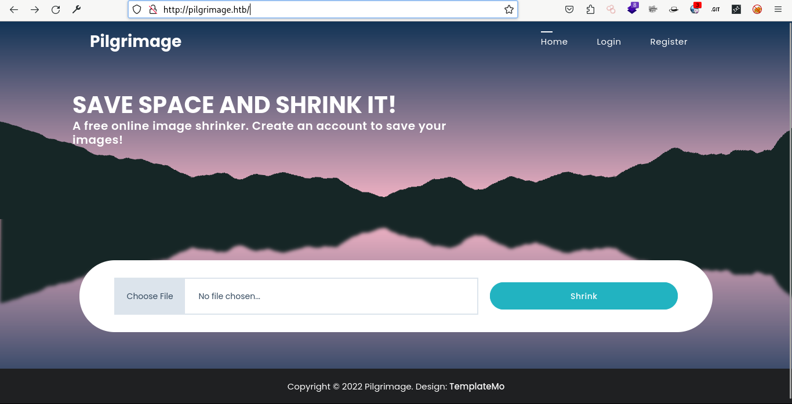
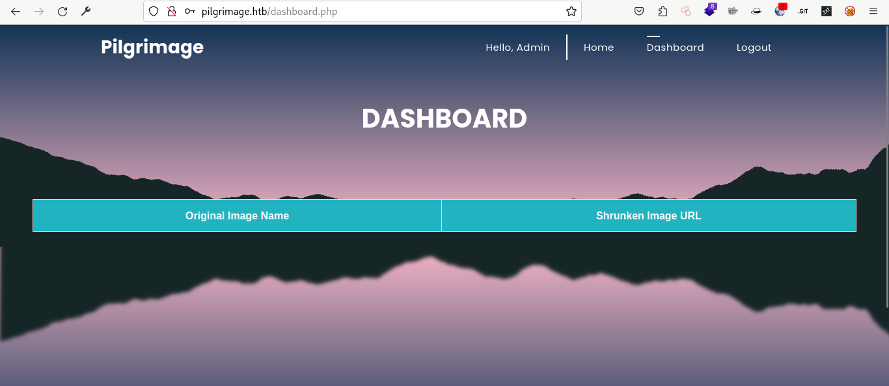

---
layout:
  title:
    visible: true
  description:
    visible: false
  tableOfContents:
    visible: true
  outline:
    visible: true
  pagination:
    visible: true
---

# Pilgrimage


<figure><figcaption></figcaption></figure>

```
10.10.11.219  pilgrimage.htb/
```

Primero configuramos el host:

<figure><figcaption></figcaption></figure>

## Reconocimiento:

```
sudo nmap -sS -p- -Pn --open 10.10.11.219 -vvv -oG PORT.txt
```

<figure><figcaption></figcaption></figure>

Por ahora se puede saber que es una maquina linux con 2 puertos abiertos.

```
22/tcp open  ssh     syn-ack ttl 63
80/tcp open  http    syn-ack ttl 63
```

Realice algunas prueba de conexion a ssh pero no tuve exitos.

```
ssh root@10.10.11.219
ssh admin@10.10.11.219
```

Decido probar un script de fuerza bruta contra ssh ya que nunca lo utilice, pero lo cancele ya que tardara mucho.

```
nmap -p 22 --script ssh-brute  10.10.11.219
Starting Nmap 7.94 ( https://nmap.org ) at 2023-12-05 18:22 UTC
NSE: [ssh-brute] Trying username/password pair: root:root
NSE: [ssh-brute] Trying username/password pair: admin:admin
NSE: [ssh-brute] Trying username/password pair: administrator:administrator
NSE: [ssh-brute] Trying username/password pair: webadmin:webadmin
NSE: [ssh-brute] Trying username/password pair: sysadmin:sysadmin
NSE: [ssh-brute] Trying username/password pair: netadmin:netadmin
NSE: [ssh-brute] Trying username/password pair: guest:guest
NSE: [ssh-brute] Trying username/password pair: user:user
NSE: [ssh-brute] Trying username/password pair: web:web
NSE: [ssh-brute] Trying username/password pair: test:test
NSE: [ssh-brute] Trying username/password pair: root:
NSE: [ssh-brute] Trying username/password pair: admin:
NSE: [ssh-brute] Trying username/password pair: administrator:
NSE: [ssh-brute] Trying username/password pair: webadmin:
NSE: [ssh-brute] Trying username/password pair: sysadmin:
NSE: [ssh-brute] Trying username/password pair: netadmin:
NSE: [ssh-brute] Trying username/password pair: guest:
NSE: [ssh-brute] Trying username/password pair: user:
NSE: [ssh-brute] Trying username/password pair: web:
NSE: [ssh-brute] Trying username/password pair: test:
NSE: [ssh-brute] Trying username/password pair: root:123456
```

Ahora decido entrar a la web.

<figure><figcaption></figcaption></figure>

Tiene algunas cosas interesante,para probar mas adelante,mientras tanto seguire con el reconocimeinto manual.

<figure><figcaption></figcaption></figure>

Me registre como admin y contraseña admin,y me llevo a Dashboard,pero no veo muchas cosas.

<figure><figcaption></figcaption></figure>

Utilice gobuster pero solo me sale 301.

```
gobuster dir -u http://pilgrimage.htb/dashboard.php -w ~/.repositories/SecLists/Discovery/Web-Content/PHP.fuzz.txt
```

<figure><figcaption></figcaption></figure>
