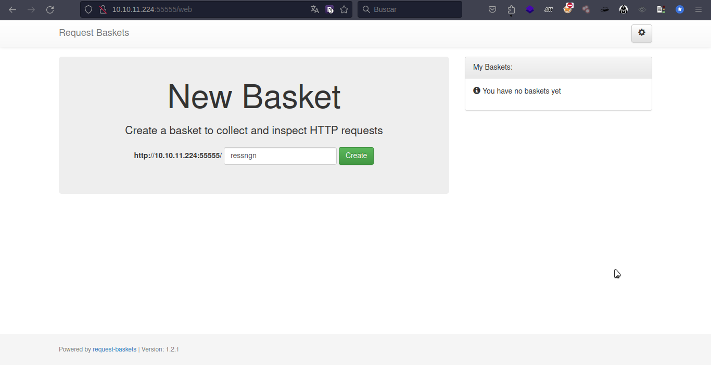
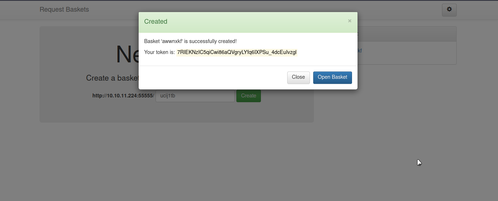
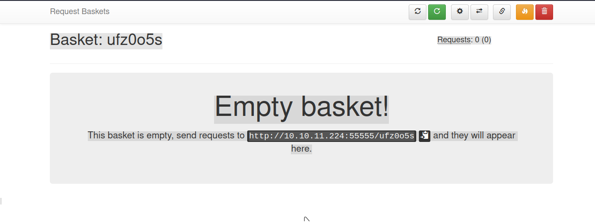
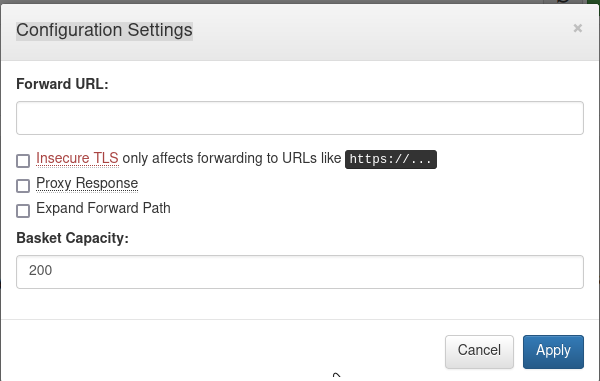
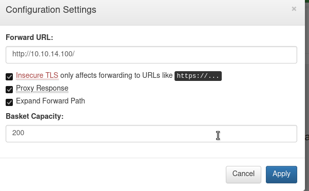

# ✅ Sau

<figure><figcaption></figcaption></figure>

## Enumeracion

### nmap

```bash
nmap -p- --open -sCV 10.10.11.224 -vvv -Pn -oG nmap
Host discovery disabled (-Pn). All addresses will be marked 'up' and scan
times may be slower.
Starting Nmap 7.94 ( https://nmap.org ) at 2024-01-14 10:22 -03
NSE: Loaded 156 scripts for scanning.
NSE: Script Pre-scanning.
NSE: Starting runlevel 1 (of 3) scan.
Initiating NSE at 10:22
Completed NSE at 10:22, 0.00s elapsed
NSE: Starting runlevel 2 (of 3) scan.
Initiating NSE at 10:22
Completed NSE at 10:22, 0.00s elapsed
NSE: Starting runlevel 3 (of 3) scan.
Initiating NSE at 10:22
Completed NSE at 10:22, 0.00s elapsed
Initiating Parallel DNS resolution of 1 host. at 10:22
Completed Parallel DNS resolution of 1 host. at 10:22, 0.05s elapsed
DNS resolution of 1 IPs took 0.05s. Mode: Async [#: 1, OK: 0, NX: 1, DR: 0
, SF: 0, TR: 1, CN: 0]
Initiating Connect Scan at 10:22
Scanning 10.10.11.224 [65535 ports]
Discovered open port 22/tcp on 10.10.11.224
Connect Scan Timing: About 23.19% done; ETC: 10:24 (0:01:43 remaining)
Discovered open port 55555/tcp on 10.10.11.224
Completed Connect Scan at 10:23, 87.39s elapsed (65535 total ports)
Initiating Service scan at 10:23
Scanning 2 services on 10.10.11.224
Completed Service scan at 10:25, 97.59s elapsed (2 services on 1 host)
NSE: Script scanning 10.10.11.224.
NSE: Starting runlevel 1 (of 3) scan.
Initiating NSE at 10:25
Completed NSE at 10:25, 5.86s elapsed
NSE: Starting runlevel 2 (of 3) scan.
Initiating NSE at 10:25
Completed NSE at 10:25, 1.23s elapsed
NSE: Starting runlevel 3 (of 3) scan.
Initiating NSE at 10:25
Completed NSE at 10:25, 0.01s elapsed
Nmap scan report for 10.10.11.224
Host is up, received user-set (0.20s latency).
Scanned at 2024-01-14 10:22:17 -03 for 192s
Not shown: 50533 closed tcp ports (conn-refused), 15000 filtered tcp ports (no-response)
Some closed ports may be reported as filtered due to --defeat-rst-ratelimit
PORT      STATE SERVICE REASON  VERSION
22/tcp    open  ssh     syn-ack OpenSSH 8.2p1 Ubuntu 4ubuntu0.7 (Ubuntu Linux; protocol 2.0)
| ssh-hostkey:
|   3072 aa:88:67:d7:13:3d:08:3a:8a:ce:9d:c4:dd:f3:e1:ed (RSA)
| ssh-rsa AAAAB3NzaC1yc2EAAAADAQABAAABgQDdY38bkvujLwIK0QnFT+VOKT9zjKiPbyHpE+cVhus9r/6I/uqPzLylknIEjMYOVbFbVd8rTGzbmXKJBdRK61WioiPlKjbqvhO/YTnlkIRXm4jxQgs+xB0l9WkQ0CdHoo/Xe3v7TBije+lqjQ2tvhUY1LH8qBmPIywCbUvyvAGvK92wQpk6CIuHnz6IIIvuZdSklB02JzQGlJgeV54kWySeUKa9RoyapbIqruBqB13esE2/5VWyav0Oq5POjQWOWeiXA6yhIlJjl7NzTp/SFNGHVhkUMSVdA7rQJf10XCafS84IMv55DPSZxwVzt8TLsh2ULTpX8FELRVESVBMxV5rMWLplIA5ScIEnEMUR9HImFVH1dzK+E8W20zZp+toLBO1Nz4/Q/9yLhJ4Et+jcjTdI1LMVeo3VZw3Tp7KHTPsIRnr8ml+3O86e0PK+qsFASDNgb3yU61FEDfA0GwPDa5QxLdknId0bsJeHdbmVUW3zax8EvR+pIraJfuibIEQxZyM=
|   256 ec:2e:b1:05:87:2a:0c:7d:b1:49:87:64:95:dc:8a:21 (ECDSA)
| ecdsa-sha2-nistp256 AAAAE2VjZHNhLXNoYTItbmlzdHAyNTYAAAAIbmlzdHAyNTYAAABBBEFMztyG0X2EUodqQ3reKn1PJNniZ4nfvqlM7XLxvF1OIzOphb7VEz4SCG6nXXNACQafGd6dIM/1Z8tp662Stbk=
|   256 b3:0c:47:fb:a2:f2:12:cc:ce:0b:58:82:0e:50:43:36 (ED25519)
|_ssh-ed25519 AAAAC3NzaC1lZDI1NTE5AAAAICYYQRfQHc6ZlP/emxzvwNILdPPElXTjMCOGH6iejfmi
55555/tcp open  unknown syn-ack
| fingerprint-strings:
|   FourOhFourRequest:
|     HTTP/1.0 400 Bad Request
|     Content-Type: text/plain; charset=utf-8
|     X-Content-Type-Options: nosniff
|     Date: Sun, 14 Jan 2024 13:25:38 GMT
|     Content-Length: 75
|     invalid basket name; the name does not match pattern: ^[wd-_\.]{1,250}$
|   GenericLines, Help, Kerberos, LDAPSearchReq, LPDString, RTSPRequest, SSLSessionReq, TLSSessionReq, TerminalServerCookie:
|     HTTP/1.1 400 Bad Request
|     Content-Type: text/plain; charset=utf-8
|     Connection: close
|     Request
|   GetRequest:
|     HTTP/1.0 302 Found
|     Content-Type: text/html; charset=utf-8
|     Location: /web
|     Date: Sun, 14 Jan 2024 13:25:06 GMT
|     Content-Length: 27
|     href="/web">Found</a>.
|   HTTPOptions:
|     HTTP/1.0 200 OK
|     Allow: GET, OPTIONS
|     Date: Sun, 14 Jan 2024 13:25:07 GMT
|_    Content-Length: 0
1 service unrecognized despite returning data. If you know the service/version, please submit the following fingerprint at https://nmap.org/cgi-bin/submit.cgi?new-service :
SF-Port55555-TCP:V=7.94%I=7%D=1/14%Time=65A3E067%P=x86_64-pc-linux-gnu%r(G
SF:etRequest,A2,"HTTP/1\.0\x20302\x20Found\r\nContent-Type:\x20text/html;\
SF:x20charset=utf-8\r\nLocation:\x20/web\r\nDate:\x20Sun,\x2014\x20Jan\x20
SF:2024\x2013:25:06\x20GMT\r\nContent-Length:\x2027\r\n\r\n<a\x20href=\"/w
SF:eb\">Found</a>\.\n\n")%r(GenericLines,67,"HTTP/1\.1\x20400\x20Bad\x20Re
SF:quest\r\nContent-Type:\x20text/plain;\x20charset=utf-8\r\nConnection:\x
SF:20close\r\n\r\n400\x20Bad\x20Request")%r(HTTPOptions,60,"HTTP/1\.0\x202
SF:00\x20OK\r\nAllow:\x20GET,\x20OPTIONS\r\nDate:\x20Sun,\x2014\x20Jan\x20
SF:2024\x2013:25:07\x20GMT\r\nContent-Length:\x200\r\n\r\n")%r(RTSPRequest
SF:,67,"HTTP/1\.1\x20400\x20Bad\x20Request\r\nContent-Type:\x20text/plain;
SF:\x20charset=utf-8\r\nConnection:\x20close\r\n\r\n400\x20Bad\x20Request"
SF:)%r(Help,67,"HTTP/1\.1\x20400\x20Bad\x20Request\r\nContent-Type:\x20tex
SF:t/plain;\x20charset=utf-8\r\nConnection:\x20close\r\n\r\n400\x20Bad\x20
SF:Request")%r(SSLSessionReq,67,"HTTP/1\.1\x20400\x20Bad\x20Request\r\nCon
SF:tent-Type:\x20text/plain;\x20charset=utf-8\r\nConnection:\x20close\r\n\
SF:r\n400\x20Bad\x20Request")%r(TerminalServerCookie,67,"HTTP/1\.1\x20400\
SF:x20Bad\x20Request\r\nContent-Type:\x20text/plain;\x20charset=utf-8\r\nC
SF:onnection:\x20close\r\n\r\n400\x20Bad\x20Request")%r(TLSSessionReq,67,"
SF:HTTP/1\.1\x20400\x20Bad\x20Request\r\nContent-Type:\x20text/plain;\x20c
SF:harset=utf-8\r\nConnection:\x20close\r\n\r\n400\x20Bad\x20Request")%r(K
SF:erberos,67,"HTTP/1\.1\x20400\x20Bad\x20Request\r\nContent-Type:\x20text
SF:/plain;\x20charset=utf-8\r\nConnection:\x20close\r\n\r\n400\x20Bad\x20R
SF:equest")%r(FourOhFourRequest,EA,"HTTP/1\.0\x20400\x20Bad\x20Request\r\n
SF:Content-Type:\x20text/plain;\x20charset=utf-8\r\nX-Content-Type-Options
SF::\x20nosniff\r\nDate:\x20Sun,\x2014\x20Jan\x202024\x2013:25:38\x20GMT\r
SF:\nContent-Length:\x2075\r\n\r\ninvalid\x20basket\x20name;\x20the\x20nam
SF:e\x20does\x20not\x20match\x20pattern:\x20\^\[\\w\\d\\-_\\\.\]{1,250}\$\
SF:n")%r(LPDString,67,"HTTP/1\.1\x20400\x20Bad\x20Request\r\nContent-Type:
SF:\x20text/plain;\x20charset=utf-8\r\nConnection:\x20close\r\n\r\n400\x20
SF:Bad\x20Request")%r(LDAPSearchReq,67,"HTTP/1\.1\x20400\x20Bad\x20Request
SF:\r\nContent-Type:\x20text/plain;\x20charset=utf-8\r\nConnection:\x20clo
SF:se\r\n\r\n400\x20Bad\x20Request");
Service Info: OS: Linux; CPE: cpe:/o:linux:linux_kernel

NSE: Script Post-scanning.
NSE: Starting runlevel 1 (of 3) scan.
Initiating NSE at 10:25
Completed NSE at 10:25, 0.00s elapsed
NSE: Starting runlevel 2 (of 3) scan.
Initiating NSE at 10:25
Completed NSE at 10:25, 0.00s elapsed
NSE: Starting runlevel 3 (of 3) scan.
Initiating NSE at 10:25
Completed NSE at 10:25, 0.00s elapsed
Read data files from: /usr/bin/../share/nmap
Service detection performed. Please report any incorrect results at https://nmap.org/submit/ .
Nmap done: 1 IP address (1 host up) scanned in 192.42 seconds

```

Se encontraron 2 puertos abiertos el puerto 22 y el puerto 55555,especialmente el puerto 55555 se puede observar que vamos a interactuar con un sitio web.El puerto 55555 TCP es un puerto no registrado, lo que significa que no está asignado a ningún servicio o protocolo específico.

```bash
sudo nmap -p- -sS --min-rate 5000 -vvv -n -Pn 10.10.11.224
[sudo] contraseña para kirov:
Host discovery disabled (-Pn). All addresses will be marked 'up' and scan
times may be slower.
Starting Nmap 7.94 ( https://nmap.org ) at 2024-01-14 12:19 -03
Initiating SYN Stealth Scan at 12:19
Scanning 10.10.11.224 [65535 ports]
Discovered open port 22/tcp on 10.10.11.224
Increasing send delay for 10.10.11.224 from 0 to 5 due to max_successful_t
ryno increase to 4
Discovered open port 55555/tcp on 10.10.11.224
Increasing send delay for 10.10.11.224 from 5 to 10 due to 1005 out of 334
9 dropped probes since last increase.
Increasing send delay for 10.10.11.224 from 10 to 20 due to max_successful
_tryno increase to 5
Increasing send delay for 10.10.11.224 from 20 to 40 due to max_successful
_tryno increase to 6
Increasing send delay for 10.10.11.224 from 40 to 80 due to 4069 out of 13563 dropped probes since last increase.
Increasing send delay for 10.10.11.224 from 80 to 160 due to max_successful_tryno increase to 7
Increasing send delay for 10.10.11.224 from 160 to 320 due to 11489 out of 38295 dropped probes since last increase.
Increasing send delay for 10.10.11.224 from 320 to 640 due to 601 out of 2002 dropped probes since last increase.
Increasing send delay for 10.10.11.224 from 640 to 1000 due to max_successful_tryno increase to 8
Warning: 10.10.11.224 giving up on port because retransmission cap hit (10).
Completed SYN Stealth Scan at 12:20, 21.66s elapsed (65535 total ports)
Nmap scan report for 10.10.11.224
Host is up, received user-set (0.21s latency).
Scanned at 2024-01-14 12:19:40 -03 for 22s
Not shown: 65531 closed tcp ports (reset)
PORT      STATE    SERVICE REASON
22/tcp    open     ssh     syn-ack ttl 63
80/tcp    filtered http    no-response
8338/tcp  filtered unknown no-response
55555/tcp open     unknown syn-ack ttl 63

Read data files from: /usr/bin/../share/nmap
Nmap done: 1 IP address (1 host up) scanned in 21.79 seconds
           Raw packets sent: 102819 (4.524MB) | Rcvd: 83985 (3.361MB)

```

Realizando otro tipo de escaneo se puede observar que posiblemente tenga los puertos 80 y 8338 abiertos.

## Reconocimiento del sitio

En una de las líneas del primer escaneo se puede observar que tiene la ruta /web en el puerto 55555.

```bash
|     HTTP/1.0 302 Found
|     Content-Type: text/html; charset=utf-8
|     Location: /web
|     Date: Sun, 14 Jan 2024 13:25:06 GMT
|     Content-Length: 27
|     href="/web">Found</a>.
```



<figure><figcaption></figcaption></figure>

Realizo la creación de un basket.

<figure><figcaption></figcaption></figure>

Y me dirijo a este sitio.

<figure><figcaption></figcaption></figure>

En la pagina principal se puede observar que herramienta utilizan y que version.

Powered by [request-baskets](https://github.com/darklynx/request-baskets) | Version: 1.2.1

request-baskets version 1.2.1 vulnerability

Se puede observar que al realizar la busqueda resquest baskets es vulnerable a SSRF.



En el sitio anterior en la parte de ajuste aparece esto:

<figure><figcaption></figcaption></figure>

Realice  algunas pruebas en el momento que cree un basket me dirige a:

http://10.10.11.224:55555/web/ufz0o5s

Voy a Configuration Settings , previamente sabemos que es vulnerable a SSRF.

<figure><figcaption></figcaption></figure>

Utilizo esta configuracion y creo un archivo index.html para podes ver si logramos ver lo que alamcena el servicio que levantemos en nuestra maquina atacante.

Levanto un servidro en mi pc para ver que respuestas tengo creando un archivo index.html desde mi maquina de atacante levanto el servidor con el port 80 :: 10.10.14.100 python3 -m http.server 80

http://10.10.14.100:8000/ Aparece el index creado internamente procesa la solicitud
